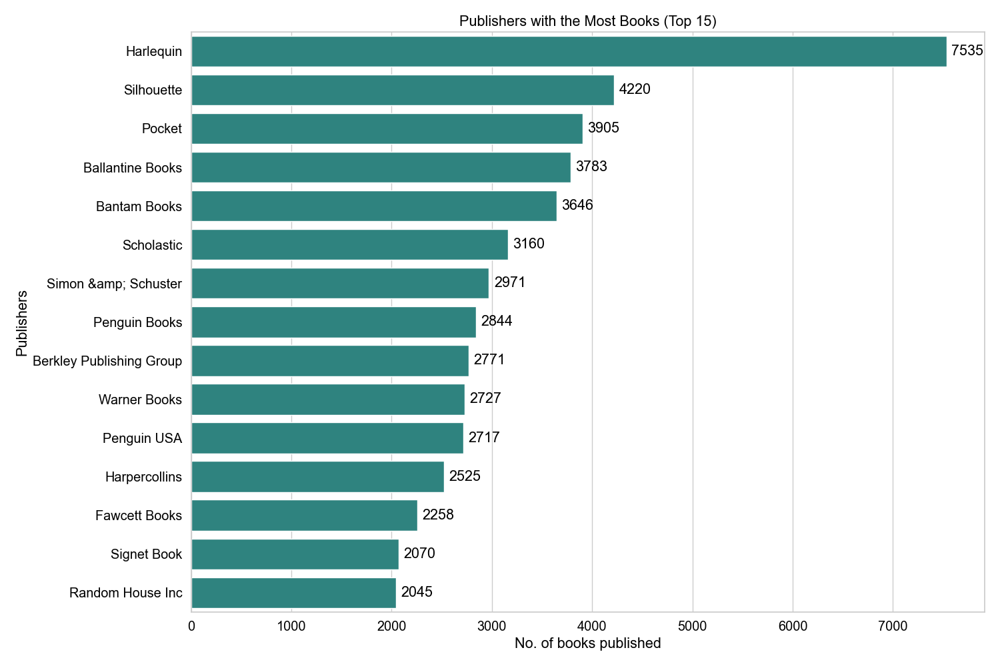
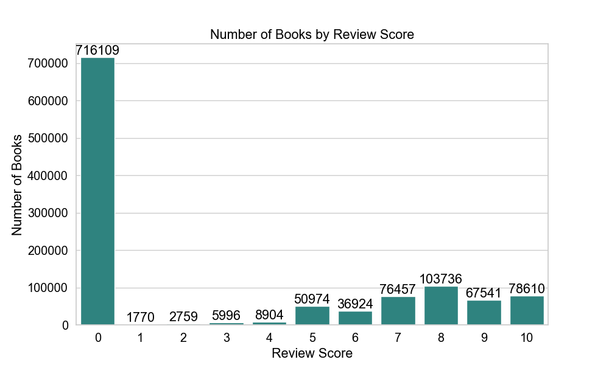
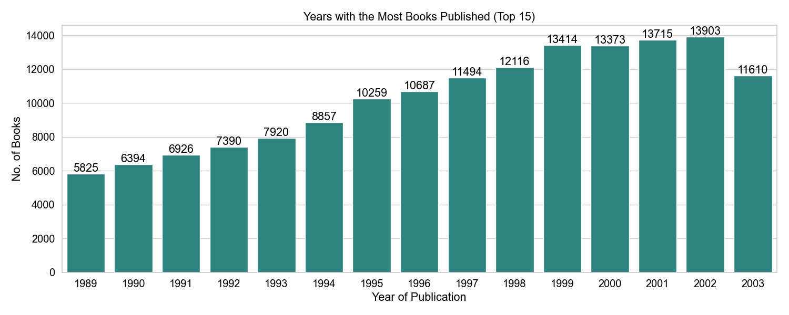
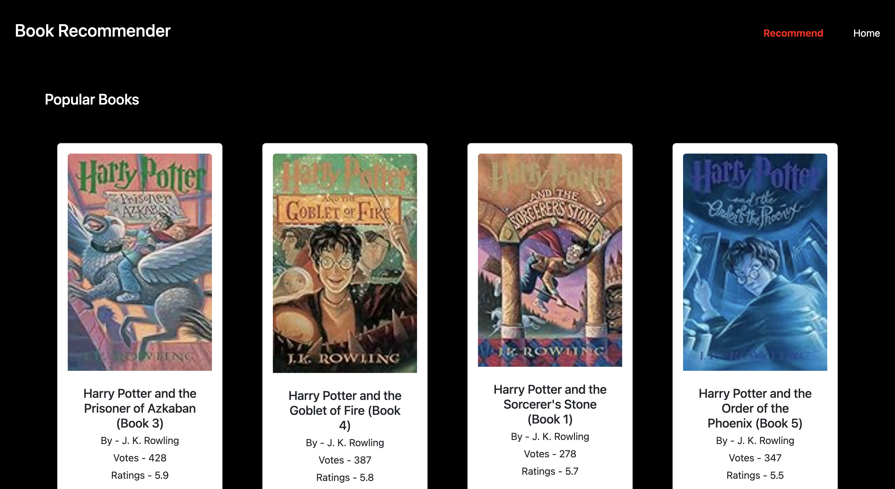
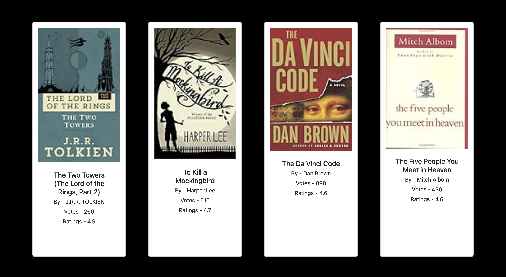
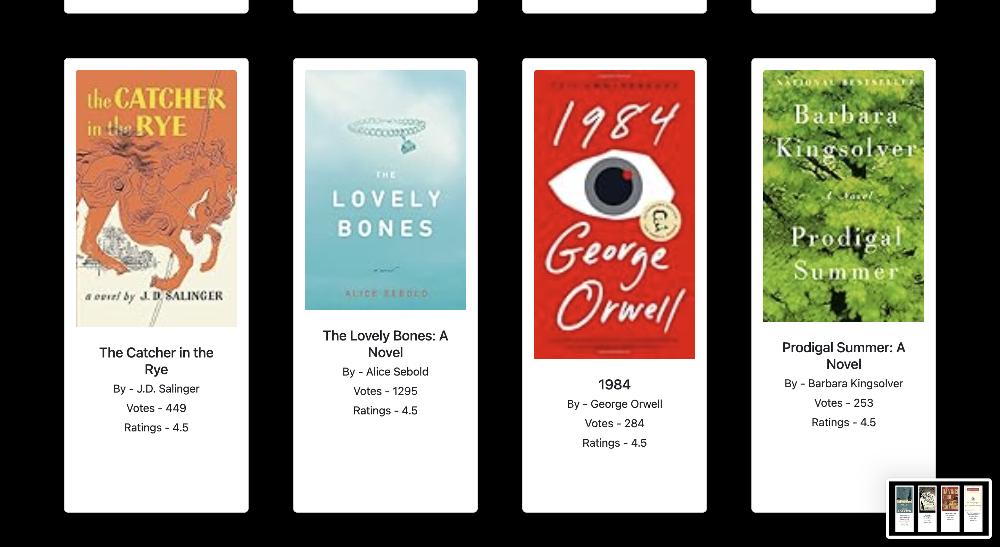
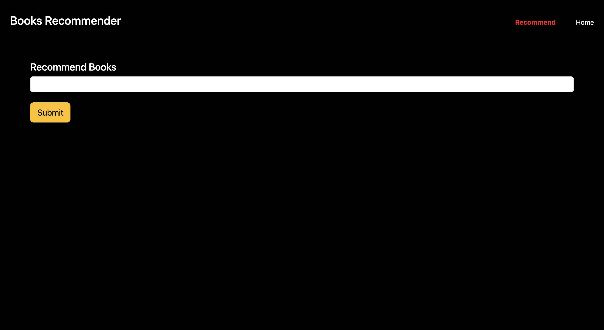
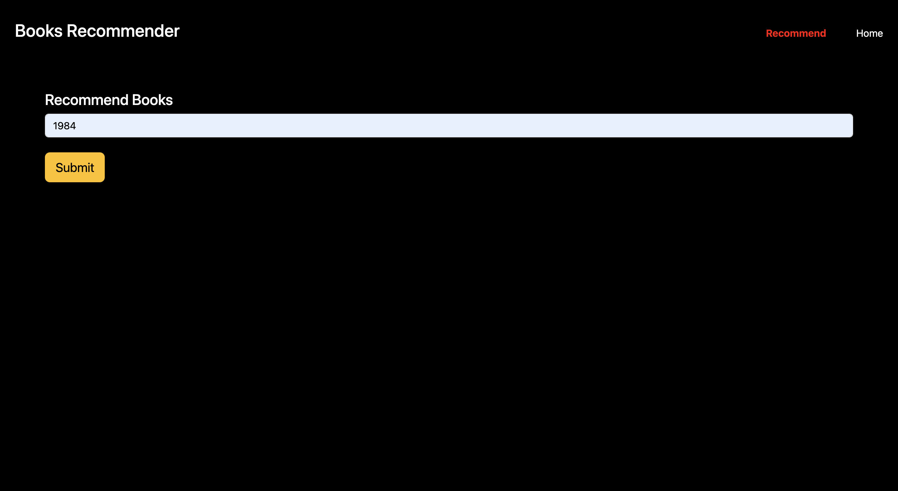
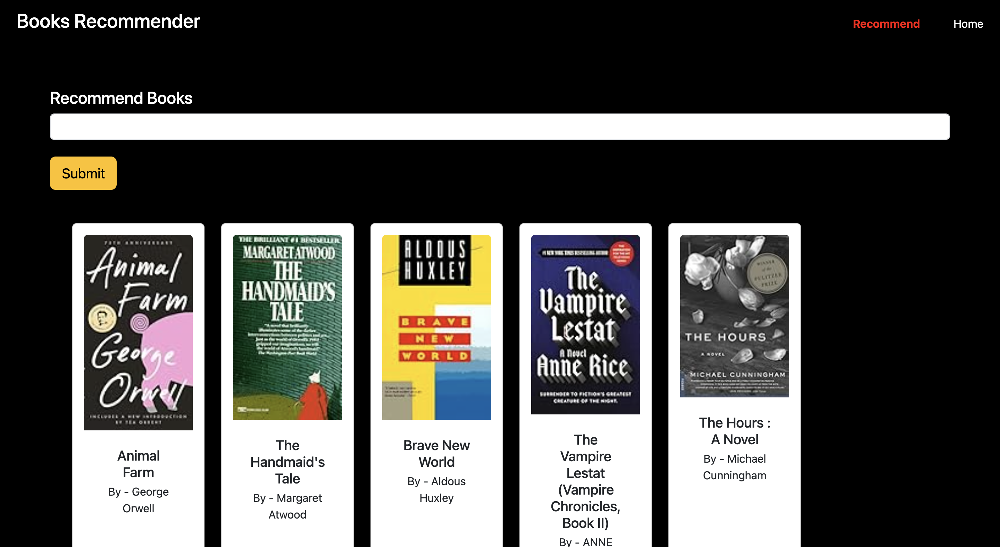

# Book Recommendation System

A complete **Book Recommendation System** that suggests books based on popularity and user preferences. This project includes **data cleaning, preprocessing, exploratory data analysis, modeling with collaborative filtering, and deployment** through a Flask web application.

---

## **Project Motivation**

With thousands of books available, finding the right one can be overwhelming. This project demonstrates how **data-driven recommendation systems** can help users discover books they are likely to enjoy. It implements both **popular recommendations** and **collaborative filtering-based personalized recommendations**.

---

## **Project Workflow**

1. **Data Exploration & Cleaning**
   - Analyzed **three datasets**: Books, Users, and Reviews.  
   - Handled missing values and inconsistent entries.  
   - Explored user ratings, review distributions, and book popularity.

2. **Popular Recommendations**
   - Aggregated ratings and user votes.  
   - Ranked books by popularity to generate top-rated book lists.  

3. **Collaborative Recommendations**
   - Used **TF-IDF vectorization** on book reviews.  
   - Calculated **cosine similarity** between books.  
   - Built a recommendation function to suggest **top 5 similar books** for a given book.  


4. **Data Visualization**
   - Explored trends using graphs and plots.  
   - Visualized top books, rating distributions, and user activity.  
   - Saved visualizations in `screenshots/` folder.  

5. **Deployment**
   - Built a **Flask web application** to interact with users.  
   - Users can browse **popular books** and get **personalized recommendations**.  
   - Screenshots and live demo included below.

---

## **Repository Structure**
```
book-recommendation-system/
│
├─ dataset/                                         # Original datasets  
├─ notebooks/                                       # Jupyter notebooks for EDA and modeling  
├─ app.py                                           # Flask web application
├─ graphs/                                          # Graph plots 
├─ src/                                             # Python scripts for preprocessing and recommendation functions  
├─ templates/                                       # HTML templates  
├─ screenshots/                                     # Screenshots of the web app and visualizations  
├─ requirements.txt                                 # Python dependencies  
├─ README.md                                        # Project documentation  
└─ .gitignore                                       # Files/folders to ignore in Git  
```
---

## **Visualizations**

### **1. Top Publishers**


### **2. Review Analysis**


### **3. Popular Authors**


### **4. Have people stoped publishing books?**


---

## **Web Application Screenshots**

### **Home Page**


### **Popular Recommendations**




### **Collaborative Recommendation (Input Book Example)**




---

## **Notebooks & Code**

### **Notebooks**
- [Notebook](notebook/notebook/book-recommendation.ipynb) 


### **Source Code**
- [Flask App](app.py)  
- [HTML Templates](templates/)  
- [CSS / Static Files](static/)  
- Optional scripts:
  - [Recommendation Functions](src/recommendation.py)

---

## **Installation & Usage**

**Clone the repository**
```bash
git clone https://github.com/yourusername/book-recommendation-system.git
cd book-recommendation-system
